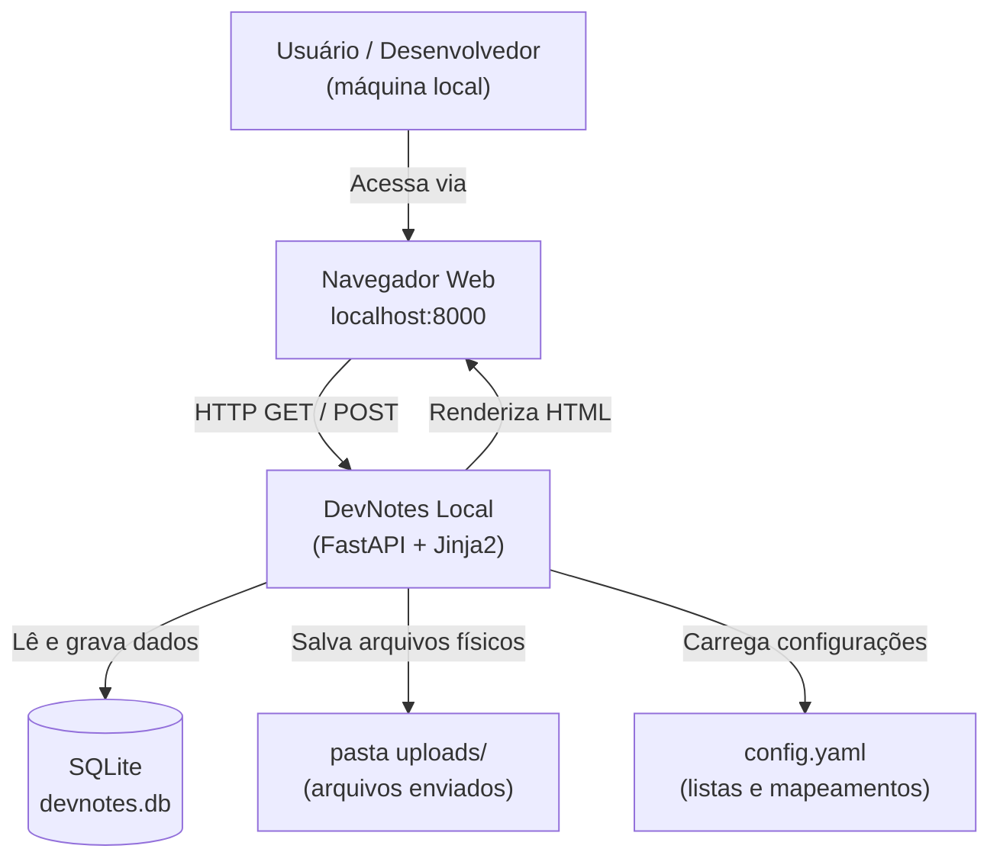
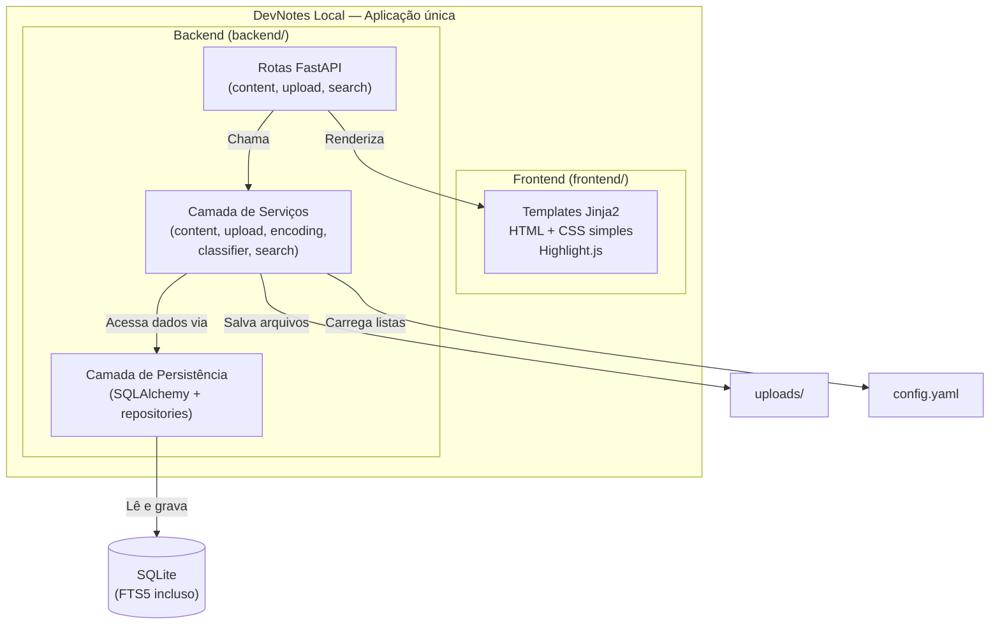
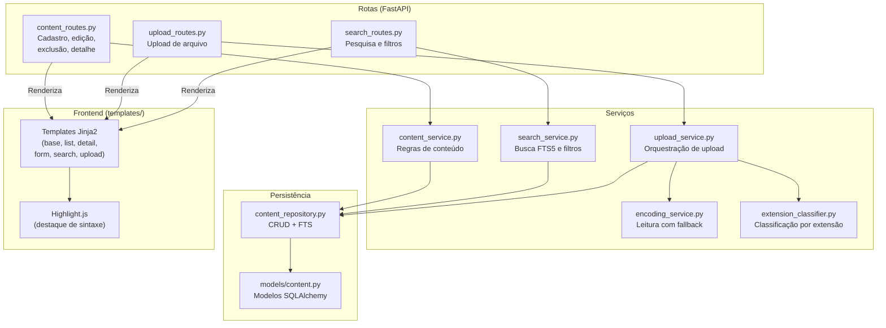
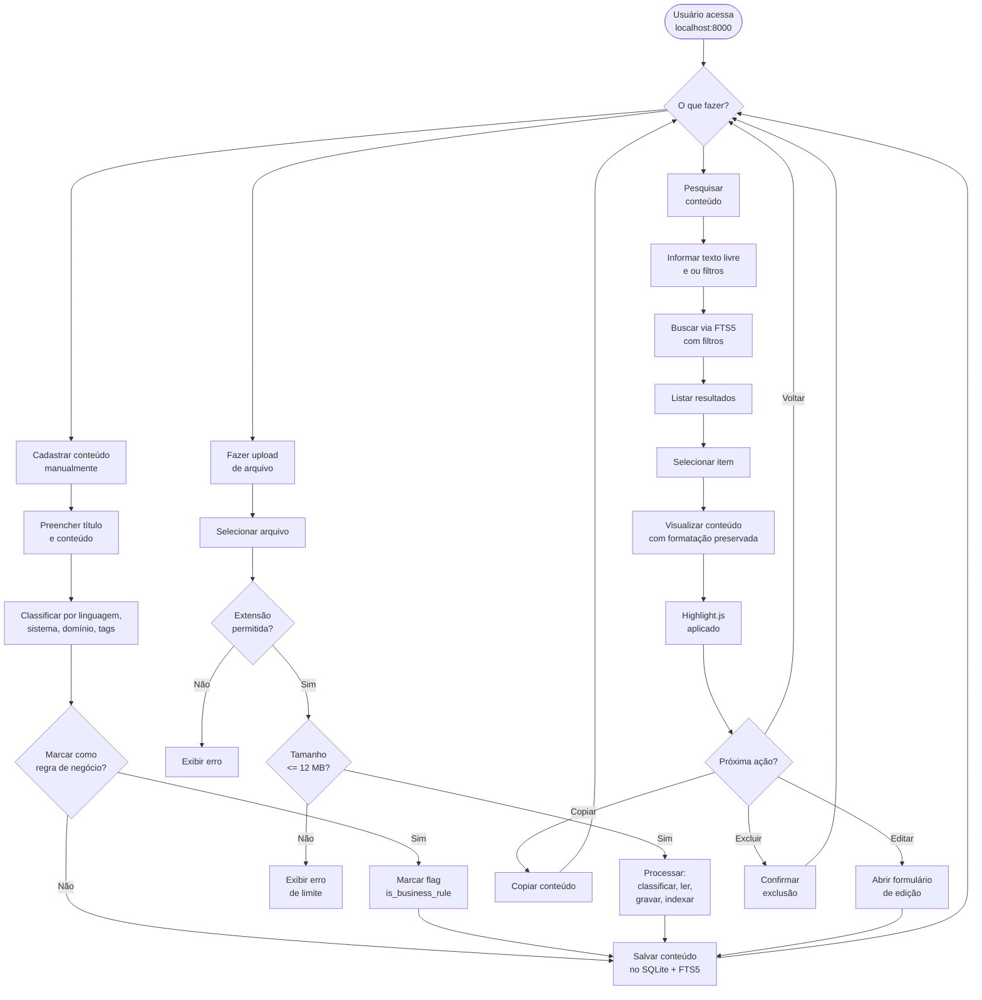
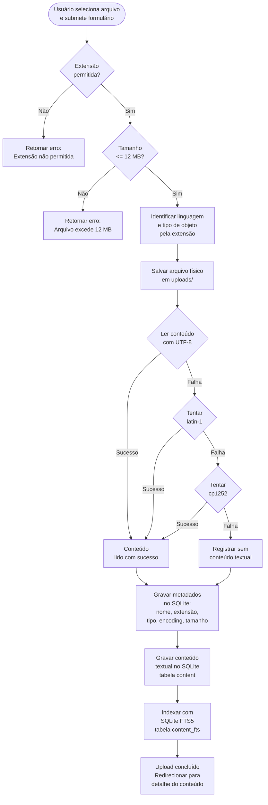
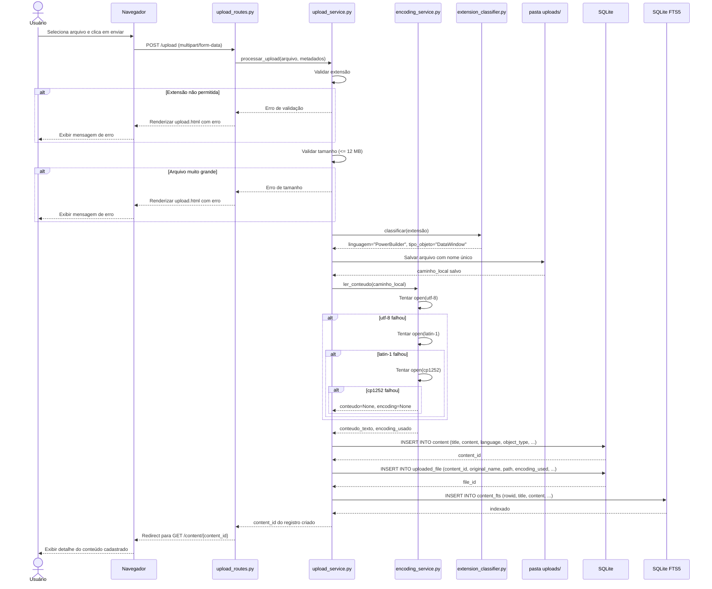

# Diagramas Arquiteturais — DevNotes Local

**Versão:** 1.0
**Atualizado em:** 2026-04-29

Todos os diagramas seguem a abordagem *Diagrams as Code* usando Mermaid em Markdown.
Quando o código mudar e o diagrama não, o diagrama está errado — atualize-o junto com a implementação.

## Índice

- [11.1 Diagrama de Contexto](#111-diagrama-de-contexto)
- [11.2 Diagrama de Containers](#112-diagrama-de-containers)
- [11.3 Diagrama de Componentes](#113-diagrama-de-componentes)
- [11.4 Fluxo Principal do Usuário](#114-fluxo-principal-do-usuário)
- [11.5 Fluxo de Upload e Indexação](#115-fluxo-de-upload-e-indexação)
- [11.6 Diagrama Entidade-Relacionamento](#116-diagrama-entidade-relacionamento)
- [11.7 Diagrama de Sequência — Upload](#117-diagrama-de-sequência--upload)

---

## 11.1 Diagrama de Contexto

**O que mostra:** quem usa o sistema e quais elementos locais fazem parte do contexto.
**Pergunta respondida:** *o que existe no ambiente e como o usuário interage com o sistema?*

---

## 11.2 Diagrama de Containers

**O que mostra:** a divisão macro da solução e como as partes principais se comunicam.
**Pergunta respondida:** *quais são os blocos principais e como eles se relacionam?*

---

## 11.3 Diagrama de Componentes

**O que mostra:** responsabilidades dos módulos internos.
**Pergunta respondida:** *quais são os componentes internos e o que cada um faz?*

---

## 11.4 Fluxo Principal do Usuário

**O que mostra:** como o usuário navega pelas principais funcionalidades do MVP.
**Pergunta respondida:** *o que o usuário pode fazer e qual é o caminho percorrido?*

---

## 11.5 Fluxo de Upload e Indexação

**O que mostra:** o processo completo de upload com todas as regras técnicas aplicadas.
**Pergunta respondida:** *onde cada validação, leitura e gravação acontece?*

Este diagrama é crítico por envolver arquivos legados PowerBuilder e cuidados de encoding.

---

## 11.6 Diagrama Entidade-Relacionamento

**O que mostra:** entidades do banco e seus relacionamentos.
**Pergunta respondida:** *como o banco de dados está estruturado?*

```mermaid
erDiagram
    CONTENT {
        int id PK
        string title
        text content
        string category
        string language
        string system
        string domain
        string object_type
        bool is_business_rule
        datetime created_at
        datetime updated_at
    }

    TAG {
        int id PK
        string name
    }

    CONTENT_TAG {
        int content_id FK
        int tag_id FK
    }

    UPLOADED_FILE {
        int id PK
        int content_id FK
        string original_name
        string saved_name
        string local_path
        string extension
        string file_type
        string object_type
        int file_size
        string encoding_used
        datetime uploaded_at
    }

    CONTENT_FTS {
        int rowid
        string title
        text content
        string category
        string language
        string system
        string domain
        string tags
    }

    CONTENT ||--o{ CONTENT_TAG : "possui"
    TAG ||--o{ CONTENT_TAG : "associada a"
    CONTENT ||--o| UPLOADED_FILE : "pode ter"
    CONTENT ||--|| CONTENT_FTS : "indexado em"
```

> `CONTENT_FTS` é uma tabela virtual FTS5. O campo `rowid` referencia o `id` de `CONTENT`. O campo `tags` é uma representação textual das tags associadas, incluída para facilitar a busca full-text.

---

## 11.7 Diagrama de Sequência — Upload

**O que mostra:** a ordem das interações entre componentes durante um upload.
**Pergunta respondida:** *onde cada regra técnica é aplicada e em qual ordem?*

