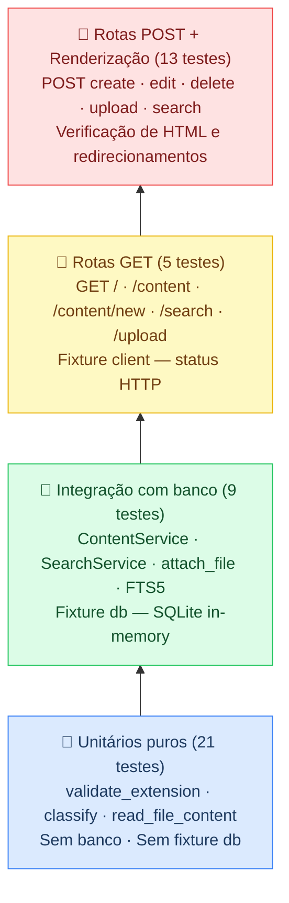

# Estratégia de Testes — DevNotes Local

## 1. Objetivo dos Testes

Os testes do DevNotes Local MVP devem garantir que as funções centrais do sistema funcionam corretamente de forma isolada e integrada. Os objetivos específicos são:

**Integridade do ciclo CRUD:**
Verificar que `ContentService.create`, `update`, `delete` e `list_all` operam corretamente sobre o banco SQLite em memória, incluindo persistência de metadados (tags, flags, campos opcionais) e consistência de retorno.

**Ciclo completo de upload:**
Garantir que o fluxo `validate_extension → leitura de bytes → verificação de tamanho (≤ 12 MB) → gravação em UPLOADS_DIR → classify → read_file_content com fallback de encoding → ContentService.create → attach_file` funciona de ponta a ponta, tanto via chamada direta de `save_upload` (com `asyncio.run` e `AsyncMock`) quanto via rota `POST /upload` com `TestClient`.

**FTS5 consultável após operações:**
Garantir que o índice FTS5 (`content_fts`) é atualizado quando um conteúdo é criado, editado ou excluído, e que as buscas via `SearchService.search` retornam (ou não retornam) os resultados esperados após cada operação.

**Cobertura das rotas POST:**
Verificar que as rotas `POST /content/new`, `POST /content/{id}/edit`, `POST /content/{id}/delete`, `POST /upload` e `POST /search` retornam os códigos HTTP corretos, redirecionam quando esperado e produzem HTML com o conteúdo esperado.

**Renderização correta de `<pre><code>`:**
Verificar que o template `detail.html` contém a estrutura `<pre><code` ao exibir um conteúdo, garantindo que Highlight.js possa aplicar destaque de sintaxe corretamente.

---

## 2. Pirâmide de Testes Simplificada



| Nível | Testes | Descrição | Exemplos de módulos |
|-------|--------|-----------|---------------------|
| **Unitários puros** | 21 | Sem banco, sem fixture `db`. Testam funções puras. | `validate_extension`, `classify`, `read_file_content` |
| **Integração com banco** | 9 | Usam fixture `db` (SQLite in-memory). Testam interação entre serviço e banco. | `ContentService`, `SearchService`, `attach_file`, FTS5 |
| **Rotas GET** | 5 | Usam fixture `client`. Verificam status HTTP básico. | `GET /`, `GET /content`, `GET /content/new`, `GET /search`, `GET /upload` |
| **Rotas POST + Renderização** | 13 | Usam fixture `client`. Verificam comportamento, redirecionamento e HTML. | `POST /content/new`, `POST /upload`, `POST /search`, `<pre><code>` |

---

## 3. Nota sobre `save_upload` (async)

`save_upload` é definida como `async def`. Há duas abordagens para testá-la:

- **Direta:** `asyncio.run(save_upload(mock_file))` com `mock_file` sendo um `MagicMock` com `.read = AsyncMock(return_value=bytes)`. Requer a fixture `upload_dir` para redirecionar `UPLOADS_DIR` via monkeypatch.
- **Via rota (recomendada para MVP):** `client.post("/upload", files={"file": (...)}, data={...})` usando `TestClient`. Mais simples, testa o fluxo real end-to-end incluindo o `ContentService.create` e o redirecionamento.

---

## 4. Padrão de Docstring para Funções de Teste

Todo `def test_*` deve conter docstring no seguinte formato:

```python
def test_create_content(db):
    """TC-CNT-01 | Integração | Verificar criação de conteúdo com campos obrigatórios."""
```

Formato: `"""TC-<ID> | <Tipo> | <Objetivo em uma linha>."""`

---

## 5. Critérios de Aceite dos Testes vs. MVP

| Critério de Aceite | Validação Automatizada | Testes que cobrem |
|--------------------|----------------------|-------------------|
| Cadastrar conteúdo com título e texto | Sim | TC-CNT-01, TC-RTE-07 |
| Editar conteúdo existente | Sim | TC-CNT-03, TC-CNT-06 |
| Excluir conteúdo existente | Sim | TC-CNT-04, TC-CNT-07 |
| Buscar por texto livre via FTS5 | Sim | TC-FTS-01, TC-SCH-04 |
| Filtrar por linguagem/categoria | Sim | TC-FTS-03, TC-SCH-05 |
| Upload de .py, .sql, .srw aceitos | Sim | TC-UPL-01, TC-UPL-02, TC-UPL-03 |
| Rejeitar extensão não permitida | Sim | TC-UPL-ERR-01, TC-UPL-ERR-02 |
| Rejeitar arquivo acima de 12 MB | Sim | TC-UPL-04 |
| Exibir `<pre><code>` no detalhe | Sim | TC-RND-01 |
| Exibir 404 amigável para ID inexistente | Sim | TC-RTE-06 |
| Fallback de encoding latin-1 | Sim | TC-ENC-02 |
| Identificar tipo de objeto PowerBuilder | Sim | TC-CLS-03, TC-CLS-04, TC-CLS-05, TC-CLS-06 |
| Registrar metadados de upload | Sim | TC-UPF-01 |
| Highlight.js aplicado na visualização | **Manual** | — (verificação visual no browser) |
| `config.yaml` carregado corretamente | **Manual** | — (indireto via extensões aceitas) |
| Suporte a múltiplas tags | Parcial — indireto | TC-CNT-01 |

---

## 6. Recomendações de Manutenção

1. **Monkeypatch de UPLOADS_DIR** — sempre use a fixture `upload_dir` em testes que invocam `save_upload` diretamente para isolar o sistema de arquivos real.

2. **Separação de fixtures** — testes de serviço usam apenas `db`; testes de rota usam `client` (que depende de `db`). Isso facilita diagnóstico.

3. **StaticPool** — o conftest usa `StaticPool` para que todas as conexões SQLAlchemy compartilhem o mesmo banco em memória. Não altere sem entender esse comportamento.

4. **Novos requisitos** — ao adicionar uma funcionalidade, siga o fluxo:
   - Registre o RF em `docs/requisitos/RF-requisitos-funcionais.md`
   - Crie o TC na tabela de casos de teste com todos os campos
   - Implemente o teste com docstring padronizada
   - Atualize a Matriz de Rastreabilidade
   - Atualize o Relatório de Execução

5. **Testes E2E (evolução futura)** — quando o MVP evoluir para ambiente compartilhado, considere adicionar testes E2E com Playwright ou Selenium para fluxos críticos.

6. **Cobertura** — para medir cobertura, instale `pytest-cov` e execute:
   ```bash
   pytest --cov=backend/app --cov-report=term-missing
   ```
