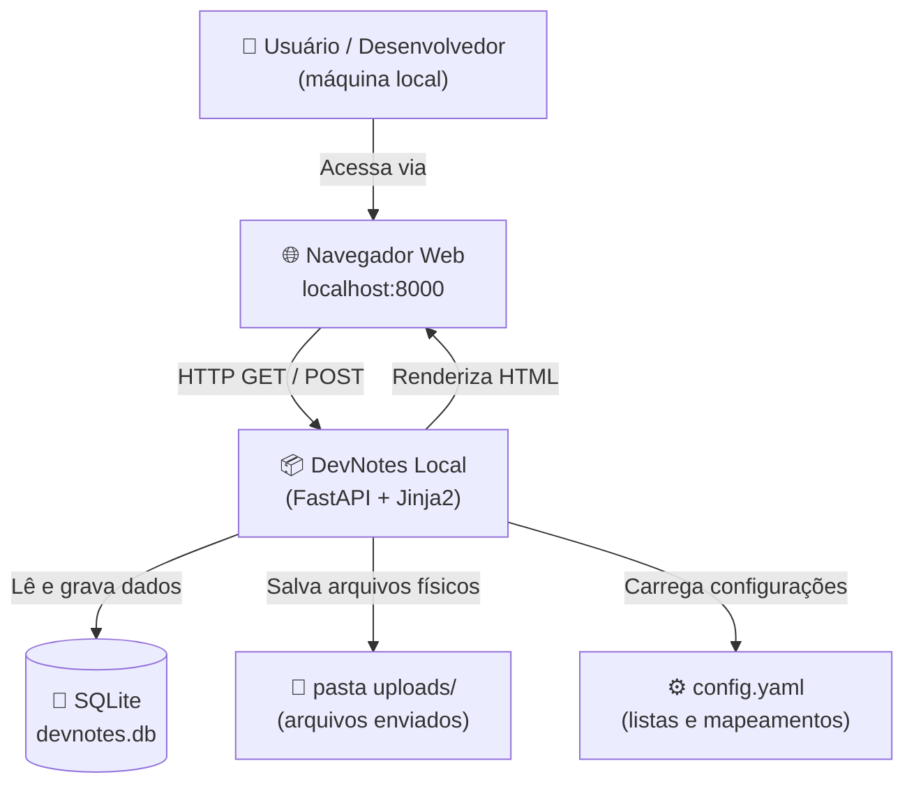
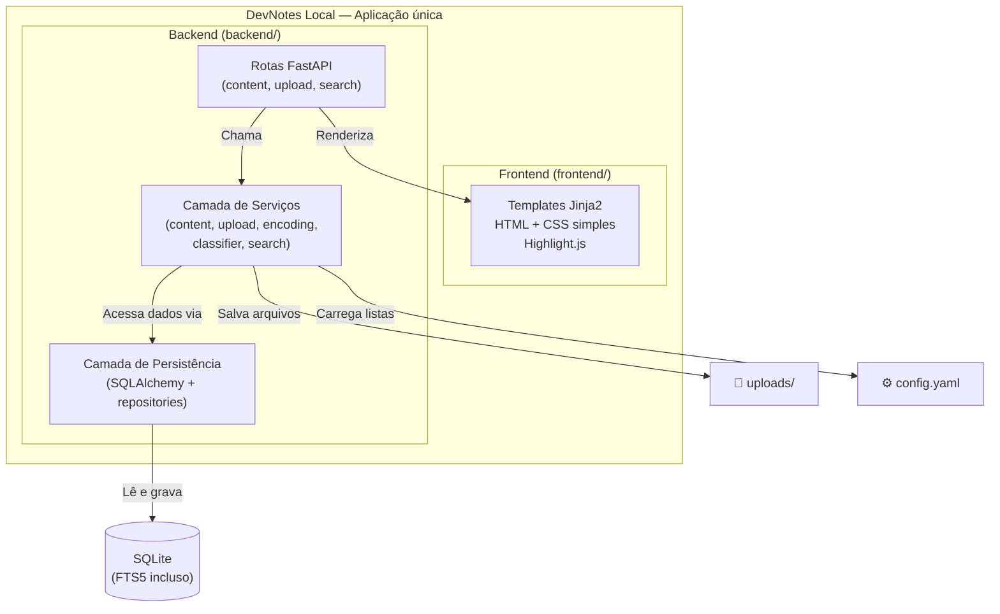
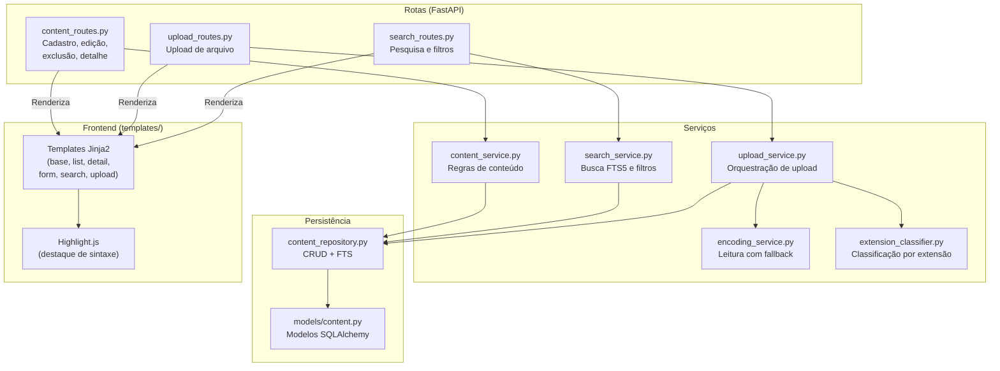
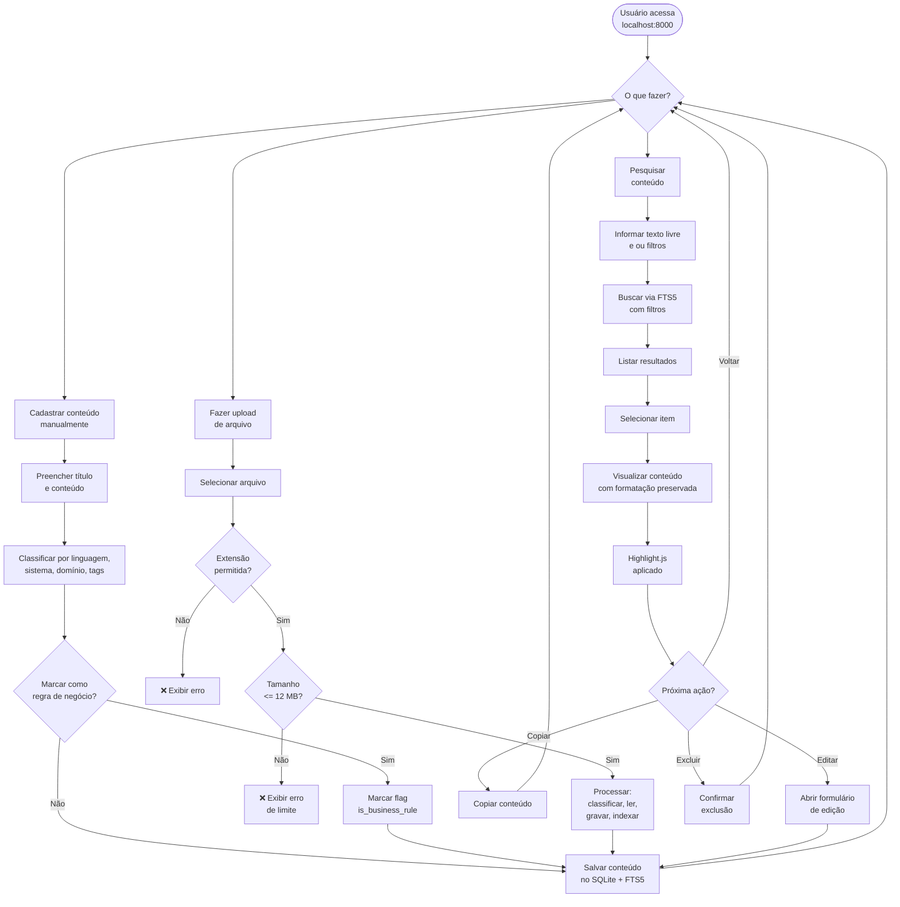
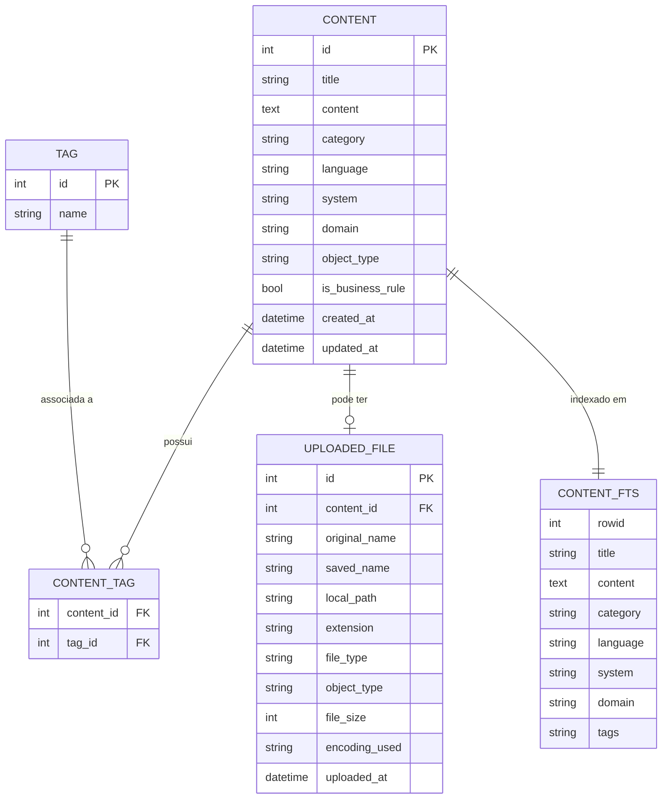
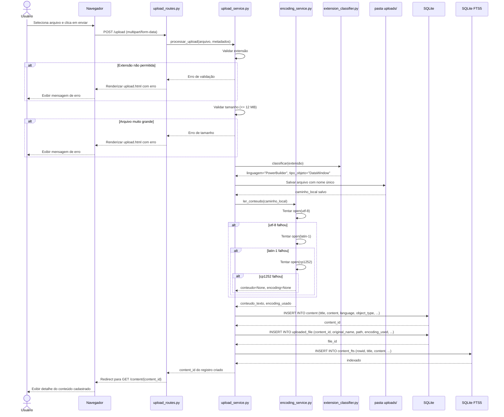

# Arquitetura e Design da Solução — DevNotes Local

Documento gerado com base no prompt "06_Prompt_de_Arquitetura_Design_da_Solução.md".

---

## 1. Visão arquitetural geral

### Por que a solução será local

O DevNotes Local é um projeto didático e de uso pessoal. Não existe requisito de acesso remoto, colaboração entre múltiplos usuários ou disponibilidade contínua. Executar a aplicação localmente elimina a necessidade de infraestrutura em nuvem, configuração de servidores, domínios, certificados TLS, CI/CD e toda a complexidade que acompanha uma solução publicada. O usuário inicia a aplicação na própria máquina e a acessa pelo navegador em `http://localhost:8000`.

### Por que FastAPI com Jinja2 é suficiente

Para um MVP local com renderização server-side, FastAPI com Jinja2 é a escolha mais direta. FastAPI oferece rotas claras, validação de entrada, suporte a upload de arquivos e um servidor embutido via Uvicorn. Jinja2 renderiza páginas HTML no servidor, evitando a necessidade de um frontend separado com build, bundler ou framework JavaScript. O resultado é uma aplicação web funcional com pouquíssima infraestrutura.

Não há justificativa para usar React, Vue, Angular ou qualquer SPA neste contexto. Essas tecnologias aumentariam a complexidade, exigiriam Node.js, build pipeline e comunicação via API JSON separada.

### Por que SQLite é adequado

SQLite é um banco de dados embutido, sem necessidade de servidor, que armazena os dados em um único arquivo local. Para um sistema com uso individual, sem concorrência de escrita e com volume moderado de dados, SQLite é mais que suficiente. Ele também oferece suporte nativo ao SQLite FTS5, que é a base da busca textual do projeto.

Usar PostgreSQL ou SQL Server seria excesso técnico para um MVP local didático.

### Por que não são necessários microsserviços, SPA, Docker ou nuvem

| Tecnologia proposta | Por que não é necessária |
|---|---|
| Microsserviços | Excesso arquitetural para uma aplicação local com uso individual |
| SPA (React/Vue) | Requer infraestrutura de build, separação de API, maior esforço |
| Docker | Útil em produção, desnecessário para executar localmente com venv |
| Nuvem | Não há requisito de acesso remoto, escala ou disponibilidade |
| Mensageria / filas | Não há operações assíncronas ou distribuídas |

A boa arquitetura para este projeto é a mais simples que atende aos requisitos. Qualquer adição além disso torna o projeto menos didático e mais difícil de entregar no prazo estimado de 3 a 12 horas.

---

## 2. Estrutura inicial de pastas e arquivos

### Árvore de diretórios

```text
devnotes-local/
│
├── backend/
│   └── app/
│       ├── __init__.py
│       ├── main.py                    # ponto de entrada do FastAPI
│       ├── config.py                  # leitura e exposição do config.yaml
│       ├── database.py                # configuração do SQLite e SQLAlchemy
│       ├── models/
│       │   ├── __init__.py
│       │   └── content.py             # modelos SQLAlchemy (tabelas)
│       ├── repositories/
│       │   ├── __init__.py
│       │   └── content_repository.py  # acesso a dados (CRUD + FTS)
│       ├── services/
│       │   ├── __init__.py
│       │   ├── content_service.py     # regras de conteúdo técnico
│       │   ├── upload_service.py      # orquestração do upload
│       │   ├── encoding_service.py    # leitura com fallback de encoding
│       │   ├── extension_classifier.py# classificação por extensão
│       │   └── search_service.py      # busca textual e filtros
│       ├── routes/
│       │   ├── __init__.py
│       │   ├── content_routes.py      # cadastro, edição, exclusão, detalhe
│       │   ├── upload_routes.py       # upload de arquivo
│       │   └── search_routes.py       # pesquisa e filtros
│       └── schemas/
│           ├── __init__.py
│           └── content_schema.py      # schemas Pydantic para validação
│
├── frontend/
│   ├── templates/
│   │   ├── base.html                  # layout base com navegação
│   │   ├── index.html                 # página inicial
│   │   ├── list.html                  # listagem de conteúdos
│   │   ├── detail.html                # detalhe do conteúdo
│   │   ├── form.html                  # formulário de cadastro e edição
│   │   ├── search.html                # tela de pesquisa e resultados
│   │   └── upload.html                # tela de upload
│   └── static/
│       ├── css/
│       │   └── style.css              # estilos simples
│       └── js/
│           └── app.js                 # JS simples, apenas se necessário
│
├── uploads/                           # arquivos enviados pelos usuários
│
├── prompts/                           # prompts utilizados no projeto (didático)
│
├── docs/                              # documentação do projeto
│   ├── features/                      # Features (estilo Azure DevOps)
│   ├── us/                            # User Stories (estilo Azure DevOps)
│   ├── tasks/                         # Tarefas técnicas (estilo Azure DevOps)
│   ├── requisitos/                    # RF, RNF e Regras de Negócio
│   ├── criterios/                     # Critérios de aceitação do MVP
│   └── riscos/                        # Registro de riscos
│
├── tests/
│   ├── __init__.py
│   ├── conftest.py                    # fixtures compartilhadas
│   ├── test_content_service.py
│   ├── test_upload_service.py
│   ├── test_encoding_service.py
│   ├── test_extension_classifier.py
│   ├── test_search_fts.py
│   └── test_routes.py
│
├── config.yaml                        # configuração centralizada do MVP
├── requirements.txt
├── README.md
├── .gitignore
└── pytest.ini
```

### Justificativa das pastas principais

| Pasta | Responsabilidade |
|---|---|
| `backend/app/` | Concentra toda a lógica da aplicação FastAPI |
| `backend/app/models/` | Define as entidades mapeadas pelo SQLAlchemy |
| `backend/app/repositories/` | Isola o acesso ao banco de dados; rotas e serviços não devem acessar diretamente o SQLAlchemy |
| `backend/app/services/` | Concentra regras de aplicação: upload, encoding, classificação, busca |
| `backend/app/routes/` | Define as rotas FastAPI, sem misturar lógica de negócio |
| `backend/app/schemas/` | Schemas Pydantic para validação de entrada das rotas |
| `frontend/templates/` | Templates Jinja2 renderizados pelo backend |
| `frontend/static/` | Arquivos estáticos servidos diretamente: CSS, JS, assets |
| `uploads/` | Armazena fisicamente os arquivos enviados |
| `prompts/` | Registro dos prompts usados durante o projeto, com finalidade didática e de versionamento |
| `docs/` | Documentação do projeto: requisitos (RF, RNF, RN), critérios de aceitação, riscos e artefatos de gestão em subpastas `features/`, `us/`, `tasks/` |
| `tests/` | Testes automatizados com pytest |

### Separação backend/ e frontend/ sem projetos independentes

A separação física entre `backend/` e `frontend/` organiza responsabilidades sem criar dois projetos independentes. O FastAPI em `backend/` serve tanto as rotas da aplicação quanto os arquivos estáticos de `frontend/static/`. Os templates em `frontend/templates/` são renderizados pelo Jinja2 configurado no FastAPI.

Não há dois servidores, dois processos, dois `package.json` ou dois repositórios. É uma única aplicação Python com organização de pastas clara.

---

## 3. Organização interna sugerida do backend

### Rotas (`routes/`)

| Arquivo | Rotas principais |
|---|---|
| `content_routes.py` | Listagem, cadastro, edição, exclusão, detalhe de conteúdos |
| `upload_routes.py` | Upload de arquivo e associação com conteúdo |
| `search_routes.py` | Pesquisa textual com filtros |

As rotas devem ser finas: recebem requisição, validam entrada com schemas Pydantic e chamam serviços. Não devem conter regras de negócio ou acesso direto ao banco.

### Serviços (`services/`)

| Arquivo | Responsabilidade |
|---|---|
| `content_service.py` | Criar, editar, excluir conteúdo; atualizar índice FTS5 |
| `upload_service.py` | Orquestrar upload: validar, salvar, classificar, extrair texto |
| `encoding_service.py` | Ler arquivo com fallback: utf-8 → latin-1 → cp1252 |
| `extension_classifier.py` | Identificar linguagem e tipo de objeto pela extensão |
| `search_service.py` | Executar busca FTS5 e aplicar filtros adicionais |

### Modelos (`models/`)

Define as classes mapeadas pelo SQLAlchemy, representando tabelas do SQLite.

### Repositórios (`repositories/`)

Encapsula as operações de persistência. Serviços chamam repositórios; repositórios chamam modelos SQLAlchemy. Essa separação facilita testes e manutenção.

### Configuração (`config.py`)

Lê o arquivo `config.yaml` na inicialização da aplicação e expõe os dados como objetos acessíveis pelos serviços (sistemas, domínios, linguagens, extensões aceitas, mapeamentos e tags pré-cadastradas).

---

## 4. Organização interna sugerida do frontend

### Templates Jinja2

| Template | Conteúdo |
|---|---|
| `base.html` | Layout base: cabeçalho, navegação e rodapé comuns |
| `index.html` | Página inicial com atalhos para principais funções |
| `list.html` | Listagem de conteúdos com metadados resumidos |
| `detail.html` | Detalhe do conteúdo com bloco `<pre><code>` e Highlight.js |
| `form.html` | Formulário único usado para cadastro e edição |
| `search.html` | Formulário de pesquisa e listagem de resultados |
| `upload.html` | Formulário de upload com indicação de extensões aceitas |

### Arquivos CSS

`style.css` concentra os estilos da aplicação. O objetivo é clareza e funcionalidade, não sofisticação visual. Foco em:

- leitura confortável do conteúdo técnico;
- bloco de código com fonte monoespaçada;
- layout simples com navegação clara.

### JavaScript

`app.js` será usado apenas se necessário. Exemplos de uso aceitável:

- botão de copiar conteúdo para a área de transferência;
- confirmação de exclusão via `confirm()`.

Nenhum framework JavaScript deve ser adicionado.

### Highlight.js

Highlight.js será carregado via CDN na tag `<head>` do `base.html`, ou localmente em `frontend/static/`. Deve ser iniciado com `hljs.highlightAll()` no final do template `detail.html`.

### Telas principais esperadas

| Tela | Descrição |
|---|---|
| Página inicial | Atalhos para listar, cadastrar, pesquisar e fazer upload |
| Listagem | Tabela com conteúdos cadastrados, metadados e links |
| Cadastro / Edição | Formulário com campos de texto e seletores |
| Detalhe | Exibição formatada com Highlight.js e botões de ação |
| Pesquisa | Campo de busca, filtros e lista de resultados |
| Upload | Formulário com indicação de extensões e limite de tamanho |

---

## 5. Proposta inicial das entidades/tabelas SQLite

### Tabela `content` — Conteúdo técnico

| Coluna | Tipo | Descrição |
|---|---|---|
| `id` | INTEGER PK | Identificador único |
| `title` | TEXT NOT NULL | Título do conteúdo |
| `content` | TEXT | Texto do conteúdo (manual ou extraído) |
| `category` | TEXT | Categoria: snippet, sql, script, anotação, regra |
| `language` | TEXT | Linguagem: Python, SQL, PowerBuilder, etc. |
| `system` | TEXT | Sistema relacionado |
| `domain` | TEXT | Domínio funcional |
| `object_type` | TEXT | Tipo de objeto (especialmente para PowerBuilder) |
| `is_business_rule` | BOOLEAN | Indica se é regra de negócio |
| `created_at` | DATETIME | Data de criação |
| `updated_at` | DATETIME | Data de última atualização |

### Tabela `tag` — Tags

| Coluna | Tipo | Descrição |
|---|---|---|
| `id` | INTEGER PK | Identificador único |
| `name` | TEXT UNIQUE | Nome da tag |

### Tabela `content_tag` — Relacionamento conteúdo-tags

| Coluna | Tipo | Descrição |
|---|---|---|
| `content_id` | INTEGER FK | Referência ao conteúdo |
| `tag_id` | INTEGER FK | Referência à tag |

### Tabela `uploaded_file` — Metadados do arquivo enviado

| Coluna | Tipo | Descrição |
|---|---|---|
| `id` | INTEGER PK | Identificador único |
| `content_id` | INTEGER FK | Referência ao conteúdo técnico associado |
| `original_name` | TEXT | Nome original do arquivo |
| `saved_name` | TEXT | Nome usado ao salvar em `uploads/` |
| `local_path` | TEXT | Caminho relativo em `uploads/` |
| `extension` | TEXT | Extensão do arquivo |
| `file_type` | TEXT | Tipo geral (Python, SQL, PowerBuilder, etc.) |
| `object_type` | TEXT | Tipo específico de objeto PowerBuilder |
| `file_size` | INTEGER | Tamanho em bytes |
| `encoding_used` | TEXT | Encoding utilizado na leitura |
| `uploaded_at` | DATETIME | Data do upload |

### Tabela virtual `content_fts` — Índice FTS5

```sql
CREATE VIRTUAL TABLE content_fts USING fts5(
    title,
    content,
    category,
    language,
    system,
    domain,
    tags,
    content='content',
    content_rowid='id'
);
```

O índice FTS5 deve ser atualizado sempre que um conteúdo for criado, editado ou excluído. Isso pode ser feito via triggers no SQLite ou manualmente no repositório.

---

## 6. Proposta inicial das principais rotas FastAPI

| Método | Rota | Descrição |
|---|---|---|
| GET | `/` | Página inicial com atalhos |
| GET | `/content` | Listagem de conteúdos |
| GET | `/content/new` | Formulário de novo conteúdo |
| POST | `/content/new` | Salvar novo conteúdo |
| GET | `/content/{id}` | Detalhe do conteúdo |
| GET | `/content/{id}/edit` | Formulário de edição |
| POST | `/content/{id}/edit` | Salvar edição |
| POST | `/content/{id}/delete` | Excluir conteúdo (com confirmação no frontend) |
| GET | `/search` | Tela de pesquisa com formulário |
| POST | `/search` | Executar pesquisa e exibir resultados |
| GET | `/upload` | Tela de upload |
| POST | `/upload` | Processar upload de arquivo |

> Obs.: Para o MVP local, o uso de `POST` para exclusão (sem AJAX) é aceitável e evita a necessidade de JavaScript adicional. O botão de excluir no frontend pode usar um mini-formulário com método POST.

---

## 7. Proposta inicial dos principais templates Jinja2

| Template | Herda de | Funcionalidade |
|---|---|---|
| `base.html` | — | Layout base: `<head>`, navegação, bloco `content`, rodapé, Highlight.js |
| `index.html` | `base.html` | Mensagem de boas-vindas e atalhos para as principais ações |
| `list.html` | `base.html` | Tabela com conteúdos, metadados resumidos e links para ações |
| `form.html` | `base.html` | Formulário reutilizável para cadastro e edição; campos pré-preenchidos na edição |
| `detail.html` | `base.html` | Título, metadados, bloco `<pre><code>` com Highlight.js, botões editar/excluir |
| `search.html` | `base.html` | Formulário de pesquisa com campo de texto e filtros; seção de resultados |
| `upload.html` | `base.html` | Formulário de upload com indicação das extensões aceitas e limite de 12 MB |

---

## 8. Decisões arquiteturais

| Decisão | Justificativa |
|---|---|
| **FastAPI** | Framework Python moderno, com suporte a upload, validação com Pydantic, servidor Uvicorn embutido e integração direta com Jinja2 |
| **Jinja2** | Renderização server-side simples; evita a necessidade de frontend separado ou SPA |
| **SQLite** | Banco embutido, sem servidor, arquivo único; adequado para uso local e individual |
| **SQLite FTS5** | Módulo nativo do SQLite para busca textual; não exige bibliotecas externas |
| **SQLAlchemy** | ORM consolidado; organiza acesso ao banco e facilita testes com banco em memória |
| **config.yaml** | Centraliza listas e mapeamentos mutáveis sem espalhá-los pelo código; fácil de manter |
| **pasta uploads/** | Armazenamento físico simples e local para os arquivos enviados |
| **Highlight.js** | Destaque de sintaxe via CDN ou local; sem dependência de build; suporte a múltiplas linguagens |
| **venv** | Isolamento do ambiente Python; evita conflito de dependências |
| **Separação backend/frontend** | Organiza responsabilidades sem criar dois projetos independentes; melhora a legibilidade |
| **pasta prompts/** | Registro dos prompts utilizados no projeto; finalidade didática e versionamento do raciocínio com IA |
| **pasta docs/** | Documenta requisitos, critérios e riscos; armazena artefatos de gestão (features, user stories, tasks) separados em subpastas |
| **pytest** | Framework de testes padrão no ecossistema Python; suporte a fixtures, client HTTP e banco em memória |

---

## 9. Riscos técnicos e mitigação

| Risco | Impacto | Mitigação |
|---|---|---|
| **Encoding de arquivos legados** | Arquivos PowerBuilder antigos podem não estar em UTF-8; leitura pode falhar | Implementar fallback: tentar `utf-8`, depois `latin-1`, depois `cp1252`; registrar qual encoding foi usado |
| **Limite de upload** | Arquivo maior que 12 MB pode causar lentidão ou falha silenciosa | Validar tamanho antes de processar; configurar limite no FastAPI e exibir mensagem clara |
| **Validação de extensões** | Usuário pode enviar arquivo com extensão não permitida | Validar extensão no backend antes de qualquer processamento; não confiar apenas no frontend |
| **Preservação de formatação** | Conteúdo técnico perde valor se indentação e quebras de linha forem perdidas | Exibir sempre com `<pre><code>`; armazenar conteúdo original sem transformações |
| **Busca textual com FTS5** | Índice pode ficar desatualizado após edição ou exclusão | Atualizar ou recriar entrada FTS5 sempre que o conteúdo for criado, editado ou excluído |
| **Escopo excessivo** | O projeto pode crescer além do que cabe em 3 a 12 horas | Manter a lista do que está fora do MVP e recusar incrementos que não fazem parte do escopo definido |
| **Duplicidade de responsabilidades** | Regras de negócio podem migrar para as rotas ou para os templates | Manter regras nos serviços; rotas apenas orquestram; templates apenas exibem |
| **Nome de arquivo duplicado em uploads/** | Dois arquivos com o mesmo nome podem sobrescrever um ao outro | Gerar nome único ao salvar (ex.: `{uuid}_{nome_original}`) |
| **Highlight.js com linguagem incorreta** | Destaque de sintaxe pode ficar incorreto se linguagem for desconhecida | Usar detecção automática do Highlight.js como fallback; não causar erro de exibição |

---

## 10. O que não implementar nesta fase

Os itens abaixo estão fora do escopo do MVP e não devem ser iniciados durante a fase de implementação:

| Item | Motivo |
|---|---|
| **Login e autenticação** | Aplicação local e de uso individual; adiciona complexidade sem benefício |
| **Controle de usuários** | Desnecessário no contexto local |
| **Permissões e perfis de acesso** | Não há requisito de segurança multi-usuário |
| **APIs externas** | Desvia o foco do aprendizado das fases do SDLC |
| **Frontend sofisticado** | Jinja2 com HTML/CSS simples atende ao objetivo; SPA exige build e separa o projeto |
| **Microsserviços** | Excesso arquitetural; a aplicação é monolítica por design |
| **Docker obrigatório** | venv é suficiente para ambiente local |
| **Infraestrutura em nuvem** | Não há requisito de publicação ou acesso remoto |
| **Backup automático** | Pode ser evolução futura; no MVP o backup é manual |
| **Versionamento interno de snippets** | Aumenta complexidade do modelo de dados sem necessidade imediata |
| **Editor Markdown avançado** | Conteúdo é armazenado como texto puro; visualização com `<pre><code>` é suficiente |
| **Importação em lote** | Fora do escopo; upload é de um arquivo por vez |
| **Busca semântica com embeddings** | Muda a natureza do projeto; FTS5 textual é suficiente para o MVP |

---

## 11. Diagramas arquiteturais em Markdown com Mermaid

---

### 11.1. Diagrama de Contexto da Aplicação

**Objetivo:** Mostrar em alto nível quem usa o sistema e quais elementos locais fazem parte do contexto da aplicação. Esse diagrama responde à pergunta: *o que existe no ambiente e como o usuário interage com o sistema?*



---

### 11.2. Diagrama de Containers — Visão de Alto Nível

**Objetivo:** Explicar a divisão macro da solução e como as partes principais se comunicam. Esse diagrama responde à pergunta: *quais são os blocos principais da solução e como eles se relacionam?*



---

### 11.3. Diagrama de Componentes

**Objetivo:** Mostrar as responsabilidades dos módulos internos e apoiar a implementação futura. Esse diagrama responde à pergunta: *quais são os componentes internos e o que cada um faz?*



---

### 11.4. Diagrama de Fluxo Principal do Usuário

**Objetivo:** Mostrar como o usuário navegará pelas principais funcionalidades do MVP. Esse diagrama responde à pergunta: *o que o usuário pode fazer e qual é o caminho percorrido?*



---

### 11.5. Diagrama de Fluxo de Upload e Indexação

**Objetivo:** Documentar o processo de upload com todas as suas regras técnicas. Esse diagrama é especialmente importante por envolver arquivos legados PowerBuilder e cuidados de encoding.

```mermaid
flowchart TD
    A([Usuário seleciona arquivo\ne submete formulário]) --> B{Extensão\npermitida?}

    B -->|Não| C[❌ Retornar erro:\n'Extensão não permitida']
    B -->|Sim| D{Tamanho\n<= 12 MB?}

    D -->|Não| E[❌ Retornar erro:\n'Arquivo excede o limite\nde 12 MB']
    D -->|Sim| F[Identificar linguagem\ne tipo de objeto\npela extensão]

    F --> G[Salvar arquivo físico\nem uploads/]

    G --> H{Ler conteúdo\ncom UTF-8}
    H -->|Sucesso| K[Conteúdo\nlido com sucesso]
    H -->|Falha| I{Tentar\nlatin-1}
    I -->|Sucesso| K
    I -->|Falha| J{Tentar\ncp1252}
    J -->|Sucesso| K
    J -->|Falha| L[⚠️ Registrar sem\nconteúdo textual]

    K --> M[Gravar metadados\nno SQLite:\nnome, extensão,\ntipo, encoding, tamanho]
    L --> M

    M --> N[Gravar conteúdo\ntextual no SQLite\n(tabela content)]

    N --> O[Indexar com\nSQLite FTS5\n(tabela content_fts)]

    O --> P[✅ Upload concluído\nRedirecionar para\ndetalhe do conteúdo]
```

---

### 11.6. Diagrama Entidade-Relacionamento Simplificado

**Objetivo:** Apoiar a modelagem inicial do banco SQLite e orientar a implementação com SQLAlchemy. Esse diagrama responde à pergunta: *quais são as entidades do banco e como elas se relacionam?*



> `CONTENT_FTS` é uma tabela virtual FTS5. O campo `rowid` referencia o `id` de `CONTENT`. O campo `tags` é uma representação textual das tags associadas, incluída para facilitar a busca full-text.

---

### 11.7. Diagrama de Sequência — Fluxo de Upload

**Objetivo:** Mostrar a ordem das interações entre componentes durante o upload de um arquivo, deixando claro onde cada regra técnica é aplicada.



---

## Conclusão arquitetural

A arquitetura proposta para o DevNotes Local é intencional e proporcional ao escopo do projeto:

- **Monolítica:** uma única aplicação Python, sem separação de APIs ou servidores;
- **Local:** sem nuvem, sem servidor externo, sem autenticação;
- **Simples:** camadas claras (rotas → serviços → repositórios → banco), sem padrões arquiteturais excessivos;
- **Organizada:** separação física entre `backend/` e `frontend/` para facilitar leitura e manutenção;
- **Testável:** serviços isolados do banco permitem testes unitários com banco SQLite em memória.

As decisões mais críticas do MVP são:

1. **Fallback de encoding** — garante que arquivos legados PowerBuilder sejam lidos;
2. **Atualização do índice FTS5** — garante que a busca reflita o estado atual dos dados;
3. **Preservação do conteúdo com `<pre><code>`** — garante que código, SQL e scripts sejam exibidos corretamente;
4. **Validação de extensão e tamanho no backend** — garante integridade independentemente do frontend.

O próximo passo natural é a fase de Implementação/Codificação, utilizando o prompt 05 de implementação como guia.
